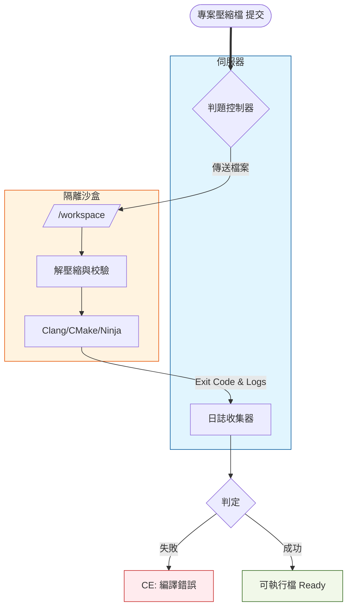

# CS3060701 期末專案 - REGS

## 概述

專案的核心目標是開發包含以下功能的後端系統：

- 跨平台方便使用
- 自動化處理
- 編譯處理
- 執行並輸出結果

同學們需要結合容器技術與現代化編譯工具鏈，解決環境隔離與自動化流程的挑戰。

## 專案目標




### 自動化編譯管道

> [參考資料：OOP專案配置教學](https://hackmd.io/@directory/Gamelab-CMake)
> 範例容器：`yhlib/cs3060701`
 
1.  任務受理與環境準備
    * **伺服器**接收壓縮檔，分配 `operatorId`。
    * 啟動容器並掛載暫存目錄。
2.  預處理
    * **伺服器**檢查專案根目錄是否存在 `CMakeLists.txt`。
3.  配置階段
    * 配置 CMake 專案，監控此步驟的 Exit Code。
    * **判定邏輯**：
        * 若失敗：狀態設為 **「初始化錯誤 SE (Setup Error)」**，代表使用者的 CMake 腳本有誤。
        * 擷取此階段的所有輸出並重導向至 `configure.log`。
4.  編譯階段
    * **執行指令**：`cmake --build build --verbose`
    * **判定邏輯**：
        * 若失敗：狀態設為 **「編譯錯誤 (Compilation Error, CE)」**，代表語法錯誤。
        * 擷取此階段的所有輸出並重導向至 `compile.log`。
5.  執行與判題
    * 當前兩個階段都成功時，執行結果
    * 進行超時控制 (TLE) 與結果比對 (AC/WA)。
    * 擷取此階段的所有輸出並重導向至 `output.log`。

> [!Tip] 實作建議
>
> 1. 關於「非同步處理」與狀態管理
>     - 實作「提交」功能時，伺服器不應該等代碼編譯完才回傳。
>     - 建議使用背景執行緒（Thread）或任務佇列（Task Queue）。伺服器收到檔案後，應先回傳一個 `operatorId`，然後在背景啟動 Docker 執行判題邏輯。
> 2. 關於判斷的控制
>     - 將主機的暫存目錄掛載到容器內的 **Volume**。
>     - Exit Code：`docker wait` 或檢查容器物件的 `State.ExitCode`
> 3. 關於 CMake 的兩階段執行
>     - 第一步執行 `cmake -G Ninja -B build`，如果這步失敗，回傳 **Setup Error**。
>     - 第二步執行 `cmake --build build`，如果這步失敗，回傳 **Compilation Error (CE)**。
>     - 日誌需要重導向，之後才能透過 API 讀取日誌。
> 4. 關於判題邏輯 (Judge Logic)
>     - 最簡單的方法是逐行比對 `user_output.txt` 與 `answer.txt`。
>     - 超時控制：不要只依賴程式內部的計時，在啟動 Docker 時設定一個 `timeout` 參數。如果容器運行超過 \<N> 秒還沒結束，直接中止容器，並將狀態標記為 **TLE**。

### 查詢功能

在 REGS 線上評測系統中，這三個 Role 定義了使用者在系統中的「權限邊界」與「行為模型」。

#### Guest (訪客)

- 未經身份驗證的匿名使用者。

#### User (一般使用者 / 參賽者)

- 已註冊並通過身份驗證的學習者，是系統的主要服務對象。

#### Admin (管理者 / 出題者)

- 維護系統內容與運作的特權使用者（如老師或助教）。

| 功能屬性              | Guest   | User          | Admin         |
| --------------------- | ------- | ------------- | ------------- |
| **瀏覽題目清單**      | O       | O             | O             |
| **提交代碼 (Submit)** | &times; | O             | O             |
| **查看他人代碼**      | &times; | &times;       | O             |
| **編輯題目/上傳測資** | &times; | &times;       | O             |
| **認證方式**          | 無  | JWT | JWT |

請規劃資料庫的權限設定，並設定 RBAC 的權限設定。

金鑰生成
```
openssl genpkey -algorithm EC -pkeyopt ec_paramgen_curve:P-256 -out private.pem
openssl pkey -in private.pem -pubout -out public.pem
```

## 配分

以下區塊說明本學期期末專案的評分基準

### 自動化編譯管道

| Metrics          | Description                                                   | Check Point                                   | Score |
| ---------------- | ------------------------------------------------------------- | --------------------------------------------- | :---: |
| ZIP 上傳與解壓縮 | 支援接收 .zip 格式的專案檔，並在掛載至容器前正確解壓縮。      | 檢查目錄結構是否完整（需含 CMakeLists.txt）。 |   3   |
| 容器網段隔離     | 編譯容器與執行容器需位於不同 Network，執行容器必須完全斷網。  | 執行階段使用 --network none 以防止網路攻擊。  |   2   |
| CMake 管線自動化 | 自動執行 Configure (cmake -G) 與 Build (cmake --build) 流程。 | 必須能自動抓取各階段的 Exit Code。            |   5   |
| 五種基本狀態判定 | 系統能根據執行結果準確回傳 AC、WA、CE、RE。                   | 比對輸出 (AC/WA)；Exit Code 非 0 (RE)。       |   5   |
| 多分段日誌查詢   | 提供 API 供外部（Module B）分別查詢配置、編譯與執行日誌。     | 儲存為 config.log、compile.log 等實體檔案。   |   5   |

以上合計 20 分，為本學期及格的最低標準

---

| Metrics        | Description                                             | Check Point                                 | Score |
| -------------- | ------------------------------------------------------- | ------------------------------------------- | :---: |
| 非同步任務隊列 | 接收提交後立即回傳 operatorId，評測過程在背景執行，且可以任意重新執行某個 Job。     | 實現 Job Queue                              |   5   |
| 併發控制機制   | 限制同時進行評測的容器數量，超額任務需排隊 (Pending)。  | 實作Semaphore控制最大併發數。              |   5   |

以上合計 10 分


### 權限控管與查詢功能

|    類別     |   方法   | URL                                  | 描述                               | 權限  |
| :---------: | :------: | ------------------------------------ | ---------------------------------- | ----- |
|  UserInfo   |  `POST`  | /api/users/register                  | 註冊新使用者帳號                   | Guest |
|  UserInfo   |  `POST`  | /api/users/login                     | 使用帳號密碼登入並簽署 JWT         | Guest |
|  UserInfo   |  `POST`  | /api/users/logout                    | 登出目前登入的使用者               | User  |
|  UserInfo   |  `GET`   | /api/users/me                        | 取得目前登入使用者的個人資料       | User  |
|  UserInfo   |  `GET`   | /api/users/{user_id}/submissions     | 取得指定使用者的提交紀錄           | Guest |
|   Problem   |  `GET`   | /api/problems                        | 取得題目列表                       | Guest |
|   Problem   |  `GET`   | /api/problems/{problem_id}           | 取得單一題目的完整描述             | Guest |
|   Problem   |  `PUT`   | /api/problems                        | 建立新題目，若題目已經存在，則更新 | Admin |
|   Problem   | `DELETE` | /api/problems/{problem_id}           | 刪除題目                           | Admin |
|  *Problem   |  `GET`   | /api/problems/{problem_id}/testcases | 下載題目壓縮檔                     | Admin |
| *Submission |  `POST`  | /api/submissions                     | 提交程式碼進行評測                 | User  |
| Submission  |  `GET`   | /api/submissions                     | 查詢個人提交紀錄列表               | User  |
| *Submission |  `GET`   | /api/submissions/{operatorId}        | 取得單一提交的評測結果             | User  |
| *Submission |  `GET`   | /api/submissions/{operatorId}/source | 取得提交的原始專案檔案             | User  |
| Statistics  |  `GET`   | /api/stats/problems/{problem_id}     | 取得題目統計資料                   | Guest |
| Statistics  |  `GET`   | /api/stats/users/{user_id}           | 取得使用者統計資料                 | Guest |

前面包含 `*` 的列表 `2` 分，其餘 API `1` 分

權限大小為 Admin > User > Guest。

- 若權限標注為 **Guest**，則 Admin、User、Guest 皆可存取
- 若權限標注為 **User**，則 Admin、User 皆可存取

但對於 **User** 與 **Admin** 的請求，都必須加上 `Authorization` Header

合計 20 分

### 文件

- OpenAPI 3.0 的 API 文件
- ERD 
- 專案操作說明

文件合計10分(不拆子項)

---

## 期末測試架構

- `template/`: 學生開發模版。預期學生撰寫程式碼的地方，包含了必要的標頭檔與程式框架，當學生透過 OJ 下載題目時，預期下載這個目錄底下的檔案。
- `solution/`: 複製 `template` 後，由助教把題目撰寫完成。
- `spec/`: 測資規範。包含 `case*.h`，定義了各個測試階段的輸入與預期結果。
- `CMakeLists.txt`: 根目錄的 CMakeLists 包含了添加 Judge 的腳本。

```cmake
AddJudge("case1")
AddJudge("case2")
AddJudge("case3")
AddJudge("case4")
AddJudge("case5")
```

`AddJudge` 內的參數，與 `spec` 內的 `*.h` 匹配

## 題目定義

每個題目的 `$PROBLEM_DIR/template/CMakeLists.txt` 透過 `project()` 定義了該題目的編號，並根據 AddJudge 添加的測試名稱，生成 `${CASE_NAME}`。

```bash
#!/bin/bash
BUILD_DIR=$(openssl rand -hex 8)
cmake -S problems/006 -B /tmp/oj/$BUILD_DIR
# cmake -S problems/006 -B /tmp/oj/$BUILD_DIR -D SOURCE_ROOT=<原始碼的根目錄，未設定預設啟用 $CMAKE_CURRENT_SOURCE_DIR/solution >
cmake --build /tmp/oj/$BUILD_DIR --parallel
ctest --test-dir /tmp/oj/$BUILD_DIR
# ctest --test-dir /tmp/oj/$BUILD_DIR -V 查看詳細資訊
```

## 如何遷移至 Online Judge 系統

1. 假定學生上傳 `BXXX15YYY-001.zip`
2. 解壓縮 `BXXX15YYY-001.zip` 至 `/path/to/source` 資料夾
    - 該過程可以先使用 `cmake -S /path/to/source -B /path/to/builddir` 來確認該資料夾是否為可設定的 CMake 專案
3. `cmake -S /path/to/problem_root -B /path/to/builddir -D SOURCE_ROOT=/path/to/source` 設定專案
4. `cmake --build /path/to/builddir` 編譯專案
5. `ctest --test-dir /path/to/builddir` 運行所有的測試案例
6. 可直接執行 `/path/to/builddir/${PROJECT_NAME}-${CASE_NAME}` 來查看單一案例的執行結果

---

要系統化的開發自動化 Judge System，我們可以定義幾個參數：

|  Variable Name  | Description                  |
| :-------------: | :--------------------------- |
| `PROBLEMS_ROOT` | 包含所有題目的根目錄         |
|  `UPLOAD_DIR`   | 原始碼上傳後，解壓縮的根目錄 |
|   `BUILDDIR`    | 編譯與測試所在的根目錄       |

若學生上傳後的檔案，被解壓縮至 `/tmp/upload/56b60ab1cf95287c`，且打算在 `/tmp/judge/27a85abe71fe1764` 進行編譯：

```bash
#!/bin/bash
PROBLEMS_ROOT="/root/problems"
UPLOAD_DIR="/tmp/upload/$(openssl rand -hex 8)"
BUILDDIR="/tmp/judge/$(openssl rand -hex 8)"

# 若測試的題目為第6題
cmake -S $PROBLEMS_ROOT/113final006 -B $BUILDDIR -D SOURCE_ROOT=$UPLOAD_DIR
cmake --build $BUILDDIR --parallel
ctest --test-dir $BUILDDIR
# command $BUILDDIR/113final006-case1
```

`UPLOAD_DIR` 與 `BUILDDIR` 的階層是可以調整的，例如 `/tmp/upload/學號/題號/隨機ID`、`/tmp/upload/學號-題號-隨機ID` 等

而編譯後的執行檔，例如 `$BUILDDIR/113final006-case1` 是根據 `project` 與 `AddJudge` 定義：

```cmake
project(MyProject1)
...
AddJudge("case1")
AddJudge("12345")
```

就會生成執行檔 `MyProject1-case1` 與 `MyProject1-12345`。與資料夾的名稱無關。

## OJ 系統(以 114 學年度期末考框架為基準)

每個題目的根目錄，包含了 `settings.yaml`：

```yaml
title: Voyage Log

limits:
  totalTime: 1000
  cpuTime: 1000
  memory: 524288

presets:
  - score: 2
    replace:
      - { source: "template/entrypoint.cpp", target: "entrypoint.cpp" }
      - { source: "template/test.h", target: "test.h" }
      - { source: "online-judge/case1.h", target: "case.h" }
    excepted:
      type: file-content
      value: online-judge/case1

  - score: 2
    replace:
      - { source: "template/entrypoint.cpp", target: "entrypoint.cpp" }
      - { source: "template/test.h", target: "test.h" }
      - { source: "online-judge/case2.h", target: "case.h" }
    excepted:
      type: file-content
      value: online-judge/case2
  # ... 更多測資設定

public:
  - source: "template/entrypoint.cpp"
    target: "entrypoint.cpp"
  # ...添加更多文件，下載題目時
```

針對 `presets` 與 `public` 這兩個區塊的說明：

### `presets`：伺服器端的評測腳本

這個區塊定義了 **Online Judge 在收到學生提交的程式碼後，如何進行編譯、執行與給分**。

- 替換(定義於`replace`規則)：
    - 系統在編譯前會使用伺服器上的 `entrypoint.cpp` 與 `test.h` 覆蓋掉學生提交的環境。這確保了學生無法竄改 `main` 函式或測試框架。
    - 測資注入隱藏：將 `online-judge/caseX.h` 強制替換成 `case.h`。學生的程式碼在編譯時，吃到的會是伺服器端真正的隱藏測資，而不是他們自己本地的假測資。

- 配分機制：每個設定檔都有對應的 `score`（例如 2 分、4 分、8 分），代表通過該測資可以獲得的權重。

- 答案比對：`expected` 定義了評分標準。系統會將程式的輸出結果與 `online-judge/caseX`（純文字檔）的內容進行比對，兩者一致才算過關。


### `public`：下載題目的初始架構

該區塊定義了 **學生在剛開始作答時，系統會打包下載給他們，或是初始化在 IDE 裡的檔案列表**。

- **建構本地環境**：提供 `entrypoint.cpp`、`test.h` 與 `README.pdf`，讓學生在自己的電腦上也能順利編譯並理解題目要求。
- **提供公開範例**：這裡將 `template/case.h` 複製並重新命名為 `case.h`、`case1.h`、`case2.h`。這代表系統只發放「公開範例測資」給學生做初步除錯，而真正用於計分的 `online-judge` 目錄下的測資被完美隱藏了起來。
* **題目特供資源：** 釋出解題必需的標頭檔（如 `command.h`）。

`presets.replace` 與 `public` 都接受包含 `source` 與 `target` 的物件陣列：

```ts
{
    source: string;
    target: string;
}
```

`source` 是相對於 `settings.yaml` 的目錄路徑，以該範例來說，如果解壓縮後的 `problem.zip` 放在 `/tmp/upload/2978b898cddbf101`

- `/tmp/upload/2978b898cddbf101/settings.yaml`
    - `template/entrypoint.cpp` 對應 `/tmp/upload/2978b898cddbf101/template/entrypoint.cpp`
    - 如果是絕對路徑，則不必做其他處理(但通常不會使用絕對路徑)

>[!Caution] 學生修復上傳檔案的問題
> ### 上傳檔案處理
> 之前有學生反映，上傳的目錄可能不會包含 CMakeLists.txt。目前已經處理該問題，提供給學生的範本會包含 CMakeLists.txt。
> 也會保留的原本的測試方法：
> 使用 `cmake -S <上傳目錄> -B <編譯目錄>` 來檢查是否可以學生的上傳檔案是否可以被 configure，接著：
> 1. 把題目資料夾下的 `spec` 與 `solution/CMakeLists.txt` 複製到上傳目錄，刪除<編譯目錄>後再次執行原先的處理流程
> 2. `cmake -S <任一個 solution 的 CMakeLists.txt> -D SOURCE_DIR=$1 -D PROBLEM_ROOT=$2`
>   - 透過定義 `SOURCE_DIR` 與 `PROBLEM_ROOT` 決定要使用的上傳檔案與題目
>
> 兩種做法都可以評分
> ### 題目設定流程
> 1. 習慣上，我們先決定要提供哪些檔案，放在 `template` 資料夾下
> 2. 接下來，將 `spec` 資料夾開始添加 `case*.h` 當作測資
> 3. 最後，複製 `template` 資料夾，更名成 `solution`，並將該題解答實作完成。
> 
> `template/CMakeLists.txt` 與 `solution/CMakeLists.txt` 並不相同，差別在於Inject Secret 階段，提供給學生下載的範本不會生成 SECRET。
> 出題者必須先經過 cmake configure + compile，將題目作答完成。
> - cmake configure 階段時，會生成 `online-judge` 資料夾，將包含 `SECRET` 的 header file 生成
> - 程式執行時，測試框架會嘗試輸出 case*.h 中的 SECRET，並根據出題者植入的檢查點，輸出一些特定資訊。
> - 若同學惡意跳過測試框架的執行，雖然 `return code` 會是 0，但是輸出不會跟 `expected.value` 欄位定義的相同。故需要先查看 `return code` 再比對輸出。


前面的文章有提到，可以使用 `ctest --test-dir /path/to/builddir` 執行所有的測試。雖然同學們想要使用 JSON 格式，但是並不是如此簡單(主要跟現在台科大的 OJ 相容，所以非常麻煩)。雖然沒有 JSON 輸出。

但是 ctest 允許輸出 junit XML 格式(Jenkins, GitLab CI, CircleCI 等  CI/CD 工具的標準回報格式)：
```bash
# 執行所有測試
ctest -Q --test-dir /path/to/builddir --output-junit result.xml

# 僅執行特定測試
ctest -Q --test-dir /path/to/builddir --output-junit case1.xml -R case1
```

測試通過：
```xml!
<testcase name="case4" classname="case4" time="0.00382729" status="run">
	<properties/>
	<system-out>Valid: 13de134fb7ed014bae64d14efea7dc59635ede71ab67a71b19aed107c093c5ca
Suite: case: 8,2
Has 1 Checkpoint, PASSED</system-out>
</testcase>
```
測試失敗：
```xml!
<testcase name="case2" classname="case2" time="0.013741" status="fail">
	<failure message="Failed"/>
	<properties/>
	<system-out>...(錯誤訊息)</system-out>
</testcase>
```

助教已經把範例放在 `online-judge/result.xml` 的資料夾下了。

> [!Important] expected 的設定
> 目前使用以下設定，表示比較檔案內容與輸出。
> ```yaml=
> expected:
>   type: file-content
>   value: online-judge/case5
> ```
> 另一種做法是使用內嵌字串比對：
> ```yaml=
> expected:
>   type: string-content
>   value: |
>     Valid: 84a223ed5fbde2d62433d789b6d78a33069241cde784094f6cc0f168ea6d68eb
>     Suite: Parse - single stop
>     Has 36 Checkpoint, PASSED
> ```
> 但本作業「不會」出現該種設定。
