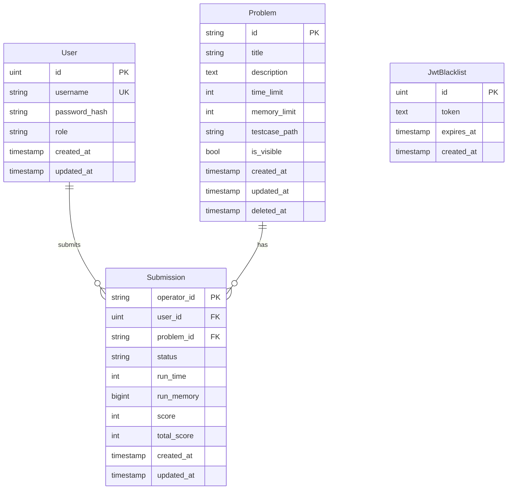

# REGS 資料庫 ERD

## 實體關係圖

## 角色權限 (RBAC)

| 角色 | 說明 |
|------|------|
| Guest | 未登入，可瀏覽公開題目與統計 |
| User | 已註冊使用者，可提交程式與查看自己的紀錄 |
| Admin | 管理者，可管理題目、測資，並查看他人提交 |

權限階層：Admin > User > Guest

## 提交狀態

| 狀態 | 說明 |
|------|------|
| Pending | 等待評測或排隊中 |
| Compiling | 正在編譯 |
| Judging | 正在執行測試 |
| SE | Setup Error（CMake Configure 失敗） |
| CE | Compilation Error（編譯失敗） |
| AC | Accepted（全部測試通過） |
| WA | Wrong Answer（輸出不符） |
| RE | Runtime Error（執行期錯誤） |
| TLE | Time Limit Exceeded（逾時） |
